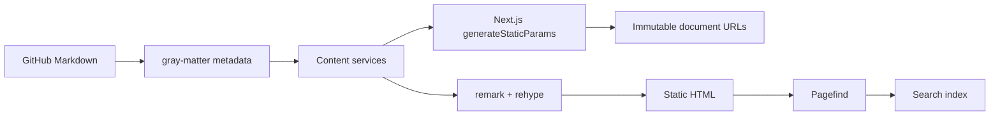

# Lorem Ipsum

Northstar is a static-first Next.js documentation platform where every document owns its own version history. A release is a Markdown file with frontmatter, not a global site snapshot.

## Architecture



The document identity is `scope / parent / slug`; the version is resolved independently with semantic versioning. Versionless routes redirect to the highest published version. Version routes are generated for every Markdown file and remain addressable after newer versions ship.

## Local development

```bash
npm install
npm run validate:docs
npm run dev
```

The sample content lives under `docs/general` and `docs/topics`. Put shared assets beside a document in its `assets/` directory. The content service discovers supported assets and exposes stable `/assets/...` paths.

## GitOps workflow

1. Add or change a versioned Markdown file in a pull request.
2. Include required frontmatter: `id`, `title`, `version`, `status`, `author`, and `owner`.
3. Set `status: review` until ownership and approval metadata are complete.
4. Merge to `main`; GitHub Actions validates metadata, type-checks, lints, builds SSG output, and creates the Pagefind index.
5. Deploy the generated Next.js output to the hosting provider of choice.

Set `NEXT_PUBLIC_SITE_URL` and `NEXT_PUBLIC_GITHUB_REPOSITORY_URL` in the deployment environment. The GitHub URL helpers then generate edit, source, history, and pull request links automatically.This is a [Next.js](https://nextjs.org) project bootstrapped with [`create-next-app`](https://nextjs.org/docs/app/api-reference/cli/create-next-app).

## Getting Started

First, run the development server:

```bash
npm run dev
# or
yarn dev
# or
pnpm dev
# or
bun dev
```

Open [http://localhost:3000](http://localhost:3000) with your browser to see the result.

You can start editing the page by modifying `app/page.tsx`. The page auto-updates as you edit the file.

## Learn More

To learn more about Next.js, take a look at the following resources:

- [Next.js Documentation](https://nextjs.org/docs) - learn about Next.js features and API.
- [Learn Next.js](https://nextjs.org/learn) - an interactive Next.js tutorial.

You can check out [the Next.js GitHub repository](https://github.com/vercel/next.js) - your feedback and contributions are welcome!

## Deploy on Vercel

The easiest way to deploy your Next.js app is to use the [Vercel Platform](https://vercel.com/new?utm_medium=default-template&filter=next.js&utm_source=create-next-app&utm_campaign=create-next-app-readme) from the creators of Next.js.

Check out our [Next.js deployment documentation](https://nextjs.org/docs/app/building-your-application/deploying) for more details.
