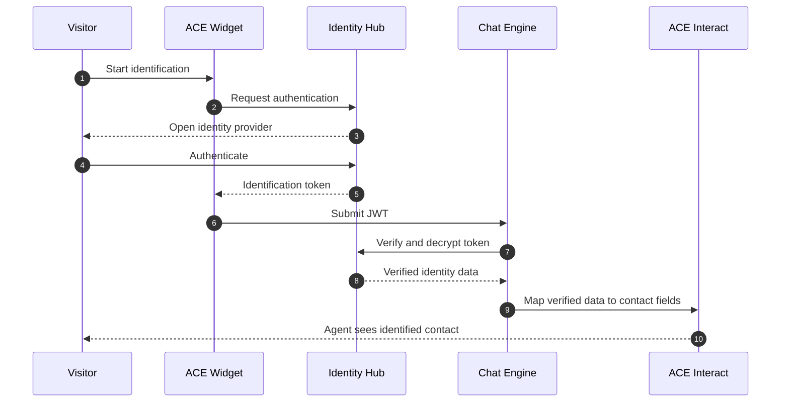

## Overview

<ChapterInfo 
  audience="All" 
  owner="TDL (or FIRST_NAME LAST_NAME)" 
  authors="Andreas Hellström" 
/>

eID Identification is a function in Telia ACE which allows visitors to identify themselves with electronic identification (eID) in chat and phone calls. Visitor identity (name and social security number) is shown to agent in ACE Interact.

Identification can be done using external trusted identity providers (like BankID, Finnish BankID, Freja eID) supported by ACE Identity Hub, or by letting the ACE customer website supply their own visitor identification token to ACE.

### Screenshot examples

Also see [Appendix C: Screenshot examples of eID Identification in use](#appendix-c-screenshot-examples-of-eid-identification-in-use).

### Terminology

- **Visitor**: The part that has phoned in or started a chat with an ACE agent. In other parts of ACE this person can also be called "end user" or "customer". Since those terms are ambiguous, avoid using those in favor of "visitor".
- **Agent**: The customer representative handling contacts with visitors.
- **Customer**: The ACE customer that has bought Telia ACE services to run their contact center. No to be confused with the ACE customer's own customers (which are called "visitors").  
- **eID**: Electronic Identification (eID) is a secure digital method for proving a visitors identity, acting as a digital ID card. It provides a trusted way to verify who you are digitally. 
- **(ACE) eID Identification**: A function in Telia ACE which allows visitors in chat, chat bot and phone call contacts to use eID methods to identify themselves. 
- **ACE Identity Hub provided eID**: Identification of visitor using services provided by by ACE Identity Hub.
- **ACE Customer provided eID**: Identification of visitor using identification token (JWT) supplied by ACE Customer website. 
- **Identification token**: A JSON web token (JWT) holding electronic identification of a visitor. 
- **Identity Provider**: Trusted identity providers, allowing users to verify their identity. Examples: 
  - (Swedish) BankID
  - Finnish BankId
  - Norweigan BankID
  - Freja eID
- **Service Provider**: The company or organisation offering one or more identity providers. Examples: 
  - Telia Tunnistus (offering Finnish BankID)
  - BankID/Finansiell ID-Teknik (offering Swedish BankID)
  - Svensk e-identitet (offering Swedish BankID, Freja eID)
  - CGI Inc. (offering Swedish BankID, Freja eID)
  - Stø AS (offering Norweigan BankID)
  - Freja eID Group (offering Freja eID)
- **(Swedish) BankID**: In Sweden, the identity provider BankID is only ever talked about as "BankID". Other countries have their own identity providers, also named "BankID" but has nothing to do with the Swedish BankId. Therefore there is a need to add a country prefix. To minimize misunderstandings, maybe it would be best to always use country prefix in documentation, also for the Swedish BankID.
- **Authentication**: (PROPOSED MEANING) In Telia ACE context, a chat or phone call visitor has authenticated themselves with an identity provider like BankID, resulting in an identification token (JWT) that is passed to Telia ACE for identification of the visitor.
- **Identification**: (PROPOSED MEANING) In Telia ACE context, a visitor is identified if they have authenticated themselves before or during a chat or phone call contact.
- **Verified information**: (PROPOSED MEANING) In Telia ACE context, an identified visitor has some personal information that is verified by an identity provider like BankID (and can be fully trusted). Usually name and social security number are verified. There might be other personal info, supplied by visitor themselves, that are not verified (email address may be one).

<!--- X. Key features ---------------------------------------------------------->

## Key features

(Redacted)

## Appendix D. Sample diagrams & drawings

### eID identification flow

[Open the editable Excalidraw source](./assets/diagrams/eid-identification-flow.excalidraw)

