## Overview

<ChapterInfo 
  audience="All" 
  owner="TDL (or FIRST_NAME LAST_NAME)" 
  authors="Andreas Hellström" 
/>

eID Identification is a function in Telia ACE which allows visitors to identify themselves with electronic identification (eID) in chat and phone calls. Visitor identity (name and social security number) is shown to agent in ACE Interact.

Identification can be done using external trusted identity providers (like BankID, Finnish BankID, Freja eID) supported by ACE Identity Hub, or by letting the ACE customer website supply their own visitor identification token to ACE.

### Screenshot examples

Also see [Appendix C: Screenshot examples of eID Identification in use](#appendix-c-screenshot-examples-of-eid-identification-in-use).

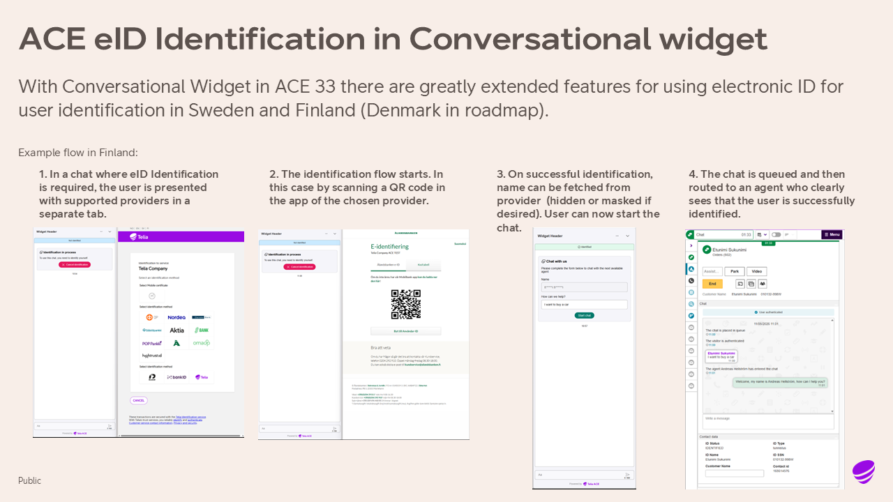

### Terminology

- **Visitor**: The part that has phoned in or started a chat with an ACE agent. In other parts of ACE this person can also be called "end user" or "customer". Since those terms are ambiguous, avoid using those in favor of "visitor".
- **Agent**: The customer representative handling contacts with visitors.
- **Customer**: The ACE customer that has bought Telia ACE services to run their contact center. No to be confused with the ACE customer's own customers (which are called "visitors").  
- **eID**: Electronic Identification (eID) is a secure digital method for proving a visitors identity, acting as a digital ID card. It provides a trusted way to verify who you are digitally. 
- **(ACE) eID Identification**: A function in Telia ACE which allows visitors in chat, chat bot and phone call contacts to use eID methods to identify themselves. 
- **ACE Identity Hub provided eID**: Identification of visitor using services provided by by ACE Identity Hub.
- **ACE Customer provided eID**: Identification of visitor using identification token (JWT) supplied by ACE Customer website. 
- **Identification token**: A JSON web token (JWT) holding electronic identification of a visitor. 
- **Identity Provider**: Trusted identity providers, allowing users to verify their identity. Examples: 
  - (Swedish) BankID
  - Finnish BankId
  - Norweigan BankID
  - Freja eID
- **Service Provider**: The company or organisation offering one or more identity providers. Examples: 
  - Telia Tunnistus (offering Finnish BankID)
  - BankID/Finansiell ID-Teknik (offering Swedish BankID)
  - Svensk e-identitet (offering Swedish BankID, Freja eID)
  - CGI Inc. (offering Swedish BankID, Freja eID)
  - Stø AS (offering Norweigan BankID)
  - Freja eID Group (offering Freja eID)
- **(Swedish) BankID**: In Sweden, the identity provider BankID is only ever talked about as "BankID". Other countries have their own identity providers, also named "BankID" but has nothing to do with the Swedish BankId. Therefore there is a need to add a country prefix. To minimize misunderstandings, maybe it would be best to always use country prefix in documentation, also for the Swedish BankID.
- **Authentication**: (PROPOSED MEANING) In Telia ACE context, a chat or phone call visitor has authenticated themselves with an identity provider like BankID, resulting in an identification token (JWT) that is passed to Telia ACE for identification of the visitor.
- **Identification**: (PROPOSED MEANING) In Telia ACE context, a visitor is identified if they have authenticated themselves before or during a chat or phone call contact.
- **Verified information**: (PROPOSED MEANING) In Telia ACE context, an identified visitor has some personal information that is verified by an identity provider like BankID (and can be fully trusted). Usually name and social security number are verified. There might be other personal info, supplied by visitor themselves, that are not verified (email address may be one).


<!--- X. Key features ---------------------------------------------------------->

## Key features

<ChapterInfo 
  audience="Telia BU (Sales, Customer Lead)" 
  owner="CPM (or FIRST_NAME LAST_NAME)" 
  authors="Andreas Hellström" 
/>

### Features

- **General**
  - Identification of visitor, using external identity providers (Swedish BankID, Finnish BankID)
  - Agent can see verified personal info (name, SSN) in Interact
  - Identified contacts are visualized in Interact (**New in ACE 33.0.0**)
- **Phone call**
  - Identification of phone call visitor while in IVR dialog or connected to an agent
  - Identification of phone call visitor using Swedish BankID
  - Identification of phone call visitor using Finnish BankID (Telia Tunnistus)
  - Agent can initiate identification of phone call visitor
- **Chat (Conversational Widget)**
  - Identification of chat visitor using Swedish BankID (**New in ACE 33.0.0**)
  - Identification of chat visitor using Finnish BankID (Telia Tunnistus)
  - Agent can initiate identification of chat visitor (**New in ACE 33.0.0**)
  - Required identification before starting a chat
  - Optional identification after starting a chat (**New in ACE 33.0.0**)
- **Chat (One Widget, Reference Chat client)**
  - Identification of chat visitor using customer provided eID JWT


### Limitations

- Chatbot identification is not supported yet.
- Third party chat identification is not supported.

### Variations

Different ways to identify a visitor:

1. **Chat widget** identification by **Identity Hub provided eID**
   - Conversational Widget can start identification of visitor in Live Agent chat before chat is started, while chat is in queue (soon), or during chat conversation, and also in Bot Agent chat (Virtual Agent).
   - Several Identity Providers are supported via Identity Hub (Swedish BankID, Finnish BankID via Telia Tunnistus). 
   - Identification can be initiated by the agent in Interact (and soon also by the visitor in the chat widget).
1. **Chat widget** identification by **Customer provided eID**
   - Customer website can supply ACE with an identification token.
   - Conversational Widget will get this at a later stage.
   - Web SDK chat clients (Refchat, One Widget) already have this.
1. **Phone call** identification by **Identity Hub Web**
   - Identity Hub Web is a customer specific card in Interact with identification tools for all types of call contacts (but only works for one part at a time in conference calls). 
   - There are tools for identification with BankID (agent enter visitor SSN in card, visitor gets sign-in request in their BankID app) and Telia Tunnistus (agent enter phone number in card, visitor gets Tunnistus weblink by SMS).
1. **Phone call** identification by **IVR dialog**
   - IVR dialog can offer phone call visitor to authenticate before call is routed to an agent.
   - Tech details: When routed to agent, contact data keys for visitor name (eidUserName) and SSN (eidUserPnr) is set by IVR.   
1. **Phone call** identification by **IVR parking**
   - A variant of Phone call identification by IVR dialog, where contact is returned to IVR and visitor is offered to authenticate.
   - Tech details: This is done by setting contact data keys to indicate for IVR to offer identification.


### Supported functionality by ACE version

#### External Identity Providers

|  Identity Provider  | By / From / Using | Chat | Phone call |
|:---|:---|:---|:---|
| Finnish BankID  | Telia Tunnistus | ACE 31.0.1 | ACE 30 |
| Swedish BankID  | Finansiell ID-Teknik <br /> Svensk e-identitet <br /> CGI Inc. | ACE 33 <br /> - <br /> - | ACE 30 <br /> - <br /> - |
| Norweigan BankID (1)  | Stø AS |  - | -  |
| Freja eID  | Freja eID Group <br /> Svensk e-identitet <br /> CGI Inc. | - <br /> - <br /> - | - <br /> - <br /> -  |
| Mobile certificate  | Telia Tunnistus | ACE 31.0.1 | ACE 30 |

*\(1): Norweigan BankID using Telia Tunnistus is sales stopped and no longer available*

#### ACE media and eID source

|  Media  | ACE Identity Hub provided eID | ACE Customer provided eID |
|:---|:---:|:---:|
| Phone call (all types)  | Yes | - |
| Conversational Widget chat  | Yes | Not yet |
| One Widget chat  | - | Yes |
| Reference Chat Client chat  | - | Yes |


<!--- X. Technical overview ---------------------------------------------------------->

## Technical overview

<ChapterInfo 
  audience="Telia BU (Delivery, Support)" 
  owner="TDL (or FIRST_NAME LAST_NAME)" 
  authors="Andreas Hellström" 
/>

### Architecture

Components:

- **ACE Identity Hub**: Backend service providing identification features in ACE to several external identity providers (BankID, Finnish BankID, Freja eID, and more). 
- **ACE Conversational Widget chat**: Online widget providing chat functionality for the visitor to chat with a customer service agent. Widget can offer functionality to authenticate the visitor before a chat is started, while chat is in queue, and during conversation with an agent. Supports eID Identification with ACE Identity Hub eID (in ACE 31.0.1), and with Customer eID (later). Configured in ACE Widget Studio.
- **ACE One Widget chat**: Older versions of online widgets providing chat functionality. These widgets support eID Identification with Customer eID. They do not, and will never, support ACE Identity Hub eID.
- **ACE Reference Chat Client**: See ACE One Widget chat.
- **ACE Chat Engine**: Backend service for chat as a channel in ACE.
- **ACE Interact**: Web-based application for customer service agents to manage chat, phone call, email and other interactions. If visitor is identified, verified identity (name, SSN or similar) is shown in Interact.
- **ACE IVR**: Provides IVR dialog to greet the end user, present information and different menu choices for the end user. Can offer functionality to identify the visitor during a phone call.
- (ACE Conversational Hub with friends not supported yet)

### Dependencies

|  Dependency  | Chat eID | Phone call eID |
|:---|:---|:---|
| ACE Identity Hub  | Yes | Yes |
| ACE Core  | Yes | Yes |
| ACE Interact  | Yes | Yes |
| External Identity providers  | Yes | Yes |
| ACE Conversation Widget  | Yes | - |
| ACE Chat Engine  | Yes | - |
| ACE IVR  | - | Yes |


### Security

- **Identity Hub**
  - encrypts personal data in identification token (JWT)
  - has an IP number whitelist of Chat Engines allowed to use decryption endpoint.
  - require basic auth  to access endpoint (configured in Chat Engine instance customer specific code), but main security is the whitelist.
  - centralizes secrets and certificate management by storing credentials, certificates, and signing keys in Vault
  - protects browser-based access with CORS filtering and optional Origin-header allowlisting on the public interface.
- **Conversational Widget**
  - cannot access encrypted personal data.
  - TBD? (Team Widgets): Describe Conversational Widget security stuff? (Iframe solution...)
- **Chat Engine**
  - decrypts personal data and forward this to Interact via ACE Main Server.
 

### Privacy

- **General**
  - Personal data can be stored in Interaction View, but will be automatically removed after a configurable amount of days.
  - Personal data from identification token is not logged to file on ACE servers, or any other location.
  - In special circumstances, Telia ACE staff can enable sensitive data to be logged for a short time to troubleshoot problems.
- **Social security number (SSN)**
  - Verified SSN is always encrypted in identification token (JWT) from Identity Hub. This data will never be available to the chat widget, it is only available to the human agent in Interact.
  - SSN can be configured to not be stored in Interaction View.
- **Name**
  - Verified name can be hidden, semi-hidden (initials only) or fully available to the chat widget. This is configured in Identity Hub.
  - Name can be configured to not be stored in Interaction View.

### Good to know

- Chat Engine verifies JWT with public key of Identity Hub. This key is stored in Erlang customer specific module customerFunctionsChatIncoming.erl on Chat Engine.
- Identity Hub defines how verified data is stored in JWT. Chat Engine uses a mapping definition to map data from JWT to contact data. This is done in customerFunctionsChatIncoming.erl. Default mapping values there should be good for most customer scenarios.


<!--- X. Set up and configure ---------------------------------------------------------->

## Set up and configure

<ChapterInfo 
  audience="Telia BU (Delivery, Support)" 
  owner="TDL (or FIRST_NAME LAST_NAME)" 
  authors="Andreas Hellström" 
/>

### Prerequisites

eID Identification has dependencies to external identity providers (BankID, Finnish BankID via Telia Tunnistus, etc). Therefor the following information is needed when setting it up.

- Customer legal name
- Customer identification number (org.no or company ID)
- Company ID (or token) with external Identity Provider
- ACE Agreement number with agreed functionality of identification in ACE Chat and ACE IVR, including agreement term (start and stop dates)
- Contact person at ACE customer who is responsible for this ACE installation
- Contact person at Telia BU or Sales who is responsible for this ACE installation

### Licensing

At least one of these ACE licenses are required.

|  License name  | Description |
|:---|:---|
| Widget - eID identification (S)  | Provides functionality for visitor to identify in chat widget. **Needed when using eID with any chat widget**. |
| IVR - eID identification (S)  | Provides functionality for visitor to identify during a phone call. **Needed when eID is initiated by visitor in IVR dialog before phone call is connected to an agent**. |
| Interact - eID identification (S)  | Provides functionality for ACE agent to initiate an identification of an ongoing contact. **Needed when eID is initiated by human agent in ACE Interact after phone call is connected to an agent** (either IVR parking or with Interact card using Identity Hub Web). |

### Configure

There are many subsystems involved in setting up eID Identification. Sections below describe on a higher level how to set things up. There are also appendices [Configuration points](#appendix-a-configuration-points) and [Configuration of what verified data to show](#appendix-a-configuration-of-what-verified-data-to-show) that show this in more detail. For full details of each step, see documentation in respective subsystem.

#### Conversational Widget (Identity Hub provided eID)

- [Configuration Instructions ACE Identity Hub](https://teliacompanyspace.sharepoint.com/sites/CCImprove/documentation/SitePages/IdHub.aspx)
- [Configuration Instructions ACE Common Domain](https://common-dev.ace.teliacompany.net/introduction/)
- [Configuration Instructions ACE Widgets](https://itwiki.atlassian.teliacompany.net/spaces/ACEW/pages/1248979585/Configuration+instructions+ACE+Widgets)
- Configuration Instructions ACE Chat
- [Configuration points in this document](#appendix-a-configuration-points) (for a summary of all configuration needed)
- Acquire correct [license](#licensing)

#### Web SDK (Customer provided eID)

- Configuration Instructions ACE Chat
- Configuration Instructions ACE Web SDK
- Acquire correct [license](#licensing)

#### Phone call - Identity Hub Web

- [Configuration Instructions ACE Identity Hub](https://teliacompanyspace.sharepoint.com/sites/CCImprove/documentation/SitePages/IdHub.aspx)
- Configuration Instructions ACE Interact
  - Add JSAPI script that will open identification card in ACE Interact
- Acquire correct [license](#licensing)

#### Phone call - IVR dialog

- Configuration Instructions for IVR
  - IVR flows need to be configured for customer (there is no existing module in IVR for this, need to be implemented on customer basis)
- Acquire correct [license](#licensing)

#### Phone call - IVR parking

- Configuration Instructions for IVR
  - IVR flows need to be configured for customer (there is no existing module in IVR for this, need to be implemented on customer basis)
- Configuration Instructions ACE Interact
  - Add JSAPI script that will open identification card in ACE Interact
- Acquire correct [license](#licensing)

### Language

Language is configured in respective subsystem, described more in [Configuration points](#appendix-a-configuration-points). Example for Finnish below.

1. In ACE Interact, agent can choose FI from supported languages (EN/SV/FI/NO/DA/DE).
1. In ACE Admin, for **chat entrance A**, translate and modify Standard phrases and Information messages from (default) English to Finnish.
1. In ACE Widget Studio, for **widget W**, configure widget to use **chat entrance A**.
1. In ACE Widget Studio, for **widget W**, configure widget to use Identity Hub **customer key K**.
1. In ACE Widget Studio, for **widget W**, translate and modify Resource texts from (default) English to Finnish.
1. In ACE Identity Hub, for **customer key K**, configure to use FI from supported languages (EN/SV/FI/NO).


<!--- X. In use ------------------------------------------------------------------------->

## In use

<ChapterInfo 
  audience="ACE Customer (Agents, Admins), Telia BU (Support)l" 
  owner="TDL (or FIRST_NAME LAST_NAME)" 
  authors="Andreas Hellström" 
/>

### User manual

#### ACE Interact

- https://ace-showcase.com/help-hub/agent-portal/

#### ACE Chat widget

- There isn't any end user documentation for the chat widget.

### Educational materials

- Not yet.


<!--- X. Troubleshooting ------------------------------------------------------------------------->

## Troubleshooting

### Configuration issues

None yet.

### End user issues

None yet.


<!--- X. FAQ --------------------------------------------------------------------------------->

## FAQ

**Q: What encryption type is used for the JWT token from ACE ID Hub?**

A: The default encryption method available in the framework Quarkus is used, which is RSA-OAEP + A256GCM.


**Q: Is there a sort of timeout if chat visitor identifies and chat queue is very long, does chat visitor have to re-identify after a certain time limit?**

A: No need to re-identify in that scenario. As soon as Chat Engine has verified the identification token (JWT), the chat session is identified as long as it lives. When chat session is ended (agent or visitor ends it, chat session gets timed out, or an error occurs), JWT is thrown away by chat widget and visitor need to re-identify if wanting to start a new chat session.


**Q: What retention time is it for personal data in ACE ID Hub?**

A: The identification token (JWT) is valid for a configurable amount of time (default 30 minutes). Configured in AddOn Admin IDHUB -> Gateway and is configured per customer.


**Q: Will the identification data be removed after token is no longer valid?**

A: It will not be removed magically when token is no longer valid (i.e., expiration time has expired). This is how things work:

- When chat widget gets JWT from ACE ID Hub there is an expiration time in it. 
- If visitor does not start a chat, chat widget will hold JWT indefinitely (there is no removal at this stage).
- If visitor starts a chat within JWT expiration time, Chat Engine will verify it correctly and chat session will be treated as identified until it ends (can be for years in theory).
- If visitor starts a chat outside JWT expiration time, Chat Engine will return an error which will make the chat widget remove the JWT.
- When chat is ended, chat widget will remove the JWT.


<!--- X. Appendix ----------------------------------------------------------------------------->

## Appendix A: Configuration points

<ChapterInfo audience="ACE Customer (Admins), Telia BU (Delivery, Support)" authors="Andreas Hellström" />

There are many subsystems involved in setting up eID Identification. This section describes in short where configuration properties are created and where they should be configured. For full instructions, see documentation for respective subsystem.

See [Configuration of what verified data to show](#appendix-a-configuration-of-what-verified-data-to-show) for sample configuration.


### ACE Identity Hub

- **Where to configure**:
  - AddOn Admin
- **Define here**:
  - IdHubPublicKey
  - IdHubCustomerKey
  - IdHubOrganisationKey
  - IdHubBasicAuthUsername
  - IdHubBasicAuthPassword
  - IdHubAuthHost
  - IdHubDecryptionUrl
  - Language:
    - Config customer key K to use language L.
    - If wanting to use multiple languages: language presentation can be configured per visitor using the concept of customer Organizations in AddOn Admin.
- **Configure here**:
  - Allowed widget origin. The domain that will embed the iframe which as default will be the domain of Conversational Widget. If Widget is self-hosted by customer it will differ.
  - Allowed Chat Engine IP:s that can use decrypt endpoint.
- **Documentation**:
  - [Configuration Instructions ACE Identity Hub](https://teliacompanyspace.sharepoint.com/sites/CCImprove/documentation/SitePages/IdHub.aspx)

### ACE Common Domain

- **Documentation**:
  - [Configuration Instructions ACE Common Domain](https://common-dev.ace.teliacompany.net/introduction/)

### ACE Conversational Widget

- **Where to configure**: 
  - Widget Studio
- **Define here**:
  - Language
    - Set implicitly by translating widget Resource texts to language L.
    - For multiple languages, create one widget per language.
- **Configure here**:
  - EidProvider
  - IdHubAuthHost
  - IdHubCustomerKey
  - IdHubOrganisationKey
  - ChatEngineUrl
  - ChatEngineInstance
  - ChatEntrance
  - ChatErrand
- **Documentation**:
  - [Configuration Instructions ACE Widgets](https://itwiki.atlassian.teliacompany.net/spaces/ACEW/pages/1248979585/Configuration+instructions+ACE+Widgets)

### ACE Chat Engine

- **Where to configure**: 
  - customerFunctionsChatIncoming.erl
- **Define here**:
  - ChatEngineUrl
  - ChatEngineInstance
- **Configure here**:
  - IdHubPublicKey
  - IdHubDecryptionUrl
  - IdHubCustomerKey
  - IdHubOrganisationKey
  - IdHubBasicAuthUsername
  - IdHubBasicAuthPassword
  - Mapping of identification token content to contact data
- **Documentation**:
  - Configuration Instructions ACE Chat

### ACE Chat

- **Where to configure**:
  - ACE Admin > Media > Chat > Chat entrances
  - ACE Admin > Statistics > Task types
- **Define here**:
  - ChatEntrance
  - ChatErrand
  - Language
    - Set implicitly by translating chat entrance Standard phrases and Information messages to language L.
    - For multiple languages, create one chat entrance per language.
- **Configure here**:
  - ChatVisitorName
  - ChatAgentName
- **Documentation**:
  - [ACE Help Hub](https://ace-showcase.com/help-hub/#humany-helphub-inline=/)


<!--- X. Appendix ----------------------------------------------------------------------------->

## Appendix B: Configuration of what verified data to show

<ChapterInfo audience="ACE Customer (Admins), Telia BU (Delivery, Support)" authors="Andreas Hellström" />

This section shows how a typical, recommended setup is configured where visitor name is shown and social security number (SSN) is hidden in Interaction View. There are some best and good practices shown, but these can obviously be tailored to your own needs.

### Typical setup for chat

#### ACE Identity Hub

Configure Identity Hub to include visitor name (first name, last name) in identification token for this ACE Customer. If visitor should not be shown the verified name, then configure Identity Hub to hide name in identification token.

#### ACE Chat Engine

```
# customerFunctionsChatIncoming.erl

authenticatedUdata() -> {"eidStatus", "IDENTIFIED"}.

aceIdHubAuthConfig() -> #{
    ...
    contactDataMapping => [
        {"completionData.user.name", ["eidUserName", "customerName"]}, 
        {"completionData.user.ssn",  ["eidUserPnr"]},
        {"eidType",                  ["eidType"]}
    ]
}.
```

- Contact data key *eidStatus* is set to string value "IDENTIFIED" when visitor is verified.
- Name property from identification token is copied to contact data keys *eidUserName* and *customerName*. There might be use cases where it is suitable to only copy to *eidUserName*, but that might have other consequences (see sections below). In future ACE version, there will be a new contact data key “visitorNameInChat” that will simplify things in this regard.
- SSN property from identification token is copied to *eidUserPnr*. Avoid using the classic ACE contact data key *Cid* for this, since that key cannot be configured to not be stored in Interaction View.
- eidType property from identification token is copied to *eidType*.

#### ACE Chat

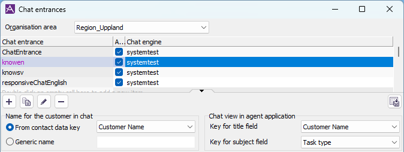

- Contact data key “customerName” (“Customer Name”) is the name that visitor supplied themselves when starting a chat, while “eidUserName” (“ID Name”) is the verified name. 
- Best practice (in ACE 32) is to use “Customer Name” as “Name for the customer in chat”. If you want the verified name to also show in chat, then configure Chat Engine contact data mapping to set “customerName” key with verified name.
- Best practice in future ACE (probably version 33) will be to use the new contact data key “visitorNameInChat” which will be set to either “eidUserName” or “customerName”.
- Good practice is to show “Customer Name” and “Task type” in “Chat view in agent application”.

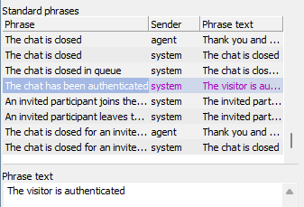

- Modify chat entrance standard phrase for authenticated chat so it better reflect the situation. If using Identity Hub eID, perhaps "“"The visitor is identified" or "The visitor has identified themselves" is a good text; if using Customer provided eID, perhaps “The chat is authenticated by the website” is a good text.

#### ACE Interact > Contact data window in ACE Interact

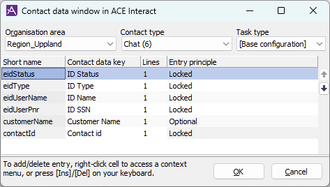

- *eidStatus* shows if contact is identified or not.
- *eidType* shows what eID provider has been used to authenticate.
- *eidUserName* is visitor name fetched from verified data. This is a Locked entry (and cannot be modified by agent).
- *eidUserPnr* is visitor social security number fetched from verified data.
- *customerName* is name entered by visitor on chat form. This may be same name as eidUserName, depending on configuration in other subsystems (Chat Engine, Identity Hub, Conversational Widget). This is a Optional entry (and can be modified by agent if needed).

#### ACE Interact > Current contacts list in ACE Interact

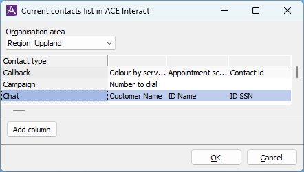

- Good practice is to show visitor supplied name (Customer Name) first, then verified name (ID Name). Many times these will probably be the same, but at times it might be advantageous to see both names. Also, for non-identified chats at least Customer Name need to be there.

#### ACE Interact > Waiting lists in ACE Interact

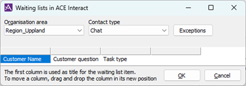

- Above is a typical setup.

#### ACE Interaction View > Contact data, basic configuration

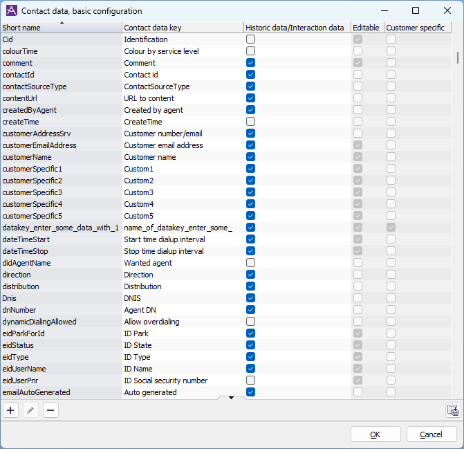

- Good practice might be to not show social security number (eidUserPnr, Cid) in Interaction View.
- Good practice is to prefix all eID contact data with “ID” to make it stand out better in contact data view in Interact.

#### ACE Interaction View > Contact data, exception names

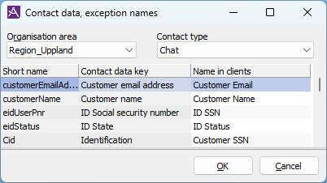

- Good practice is to use shorter names, easier words to understand, group visitor supplied data with prefix “Customer”, group verified data with prefix “ID”, and maybe change some of the predefined names. For this reason, a recommendation is to use “Contact data, exception names” view  to set name to the follow name in clients:

#### ACE Interaction View > Storage rules

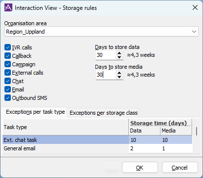

- Set storage rules to define how long time interactions should be stored.


### Visitor name configurations

- If visitor verified name **should be shown** to both agent and visitor, and in Interaction View, then follow the recommended setup in this appendix.
- If visitor verified name **should not be shown** to visitor in chat widget, then 
  1. Configure Identity Hub to hide name in identification token. 
  1. Configure “Name for customer in chat” on chat entrance to not use any contact data key containing the verified name.
- If visitor verified name **should not be stored** in Interaction View, then 
  1. Disable the Interaction data option for contact data key eidUserName (and maybe also for customerName).
  1. Configure “Name for customer in chat” on chat entrance to not use any contact data key containing the verified name.

### SSN configurations

- If visitor verified social security number **should not be shown** in Interaction View, then follow the recommended setup in this appendix. 
- If visitor verified social security number **should be shown** in Interaction View, then enable the Interaction data option for contact data key eidUserPnr.

<!--- X. Appendix ----------------------------------------------------------------------------->

## Appendix C: Screenshot examples of eID Identification in use

<ChapterInfo audience="All?" authors="Andreas Hellström" />

:::note
Screenshots will eventually be replaced with better ones when ACE 33 product texts have been finalized.
:::

### Chat, required identification with Telia Tunnistus (Conversational Widget)

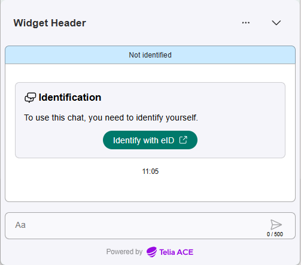

<br>

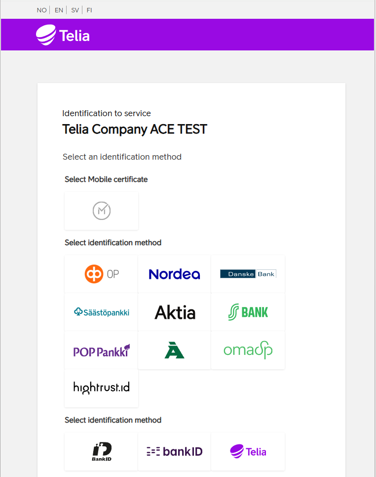

<br>

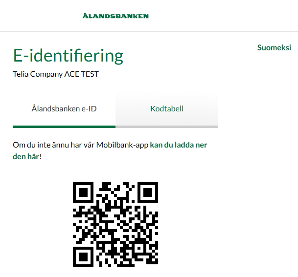

<br>

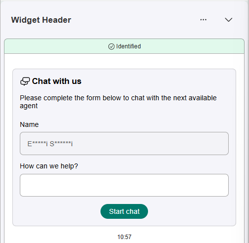

<br>

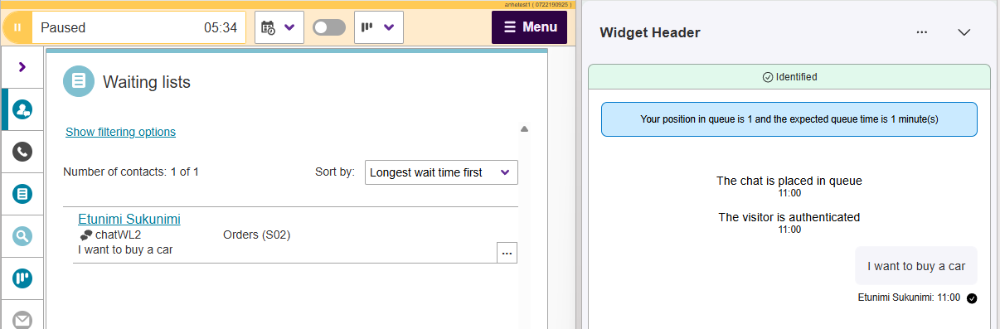

<br>

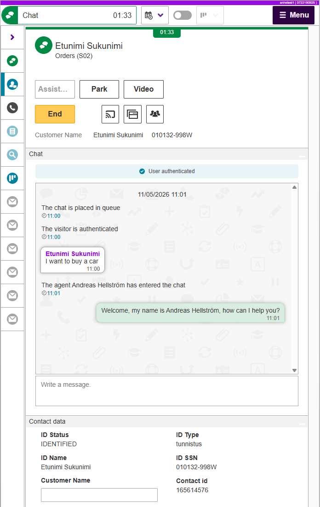

### Chat, optional identification with Swedish BankID (Conversational Widget)

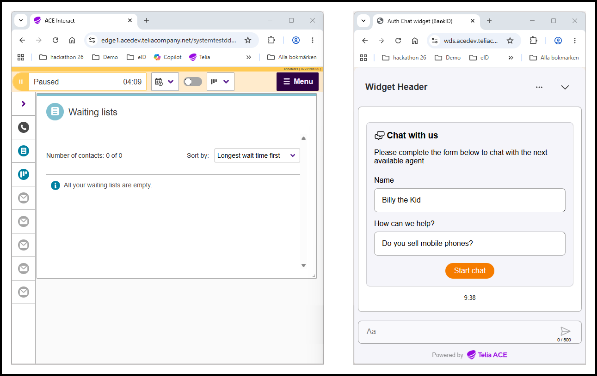

<br>

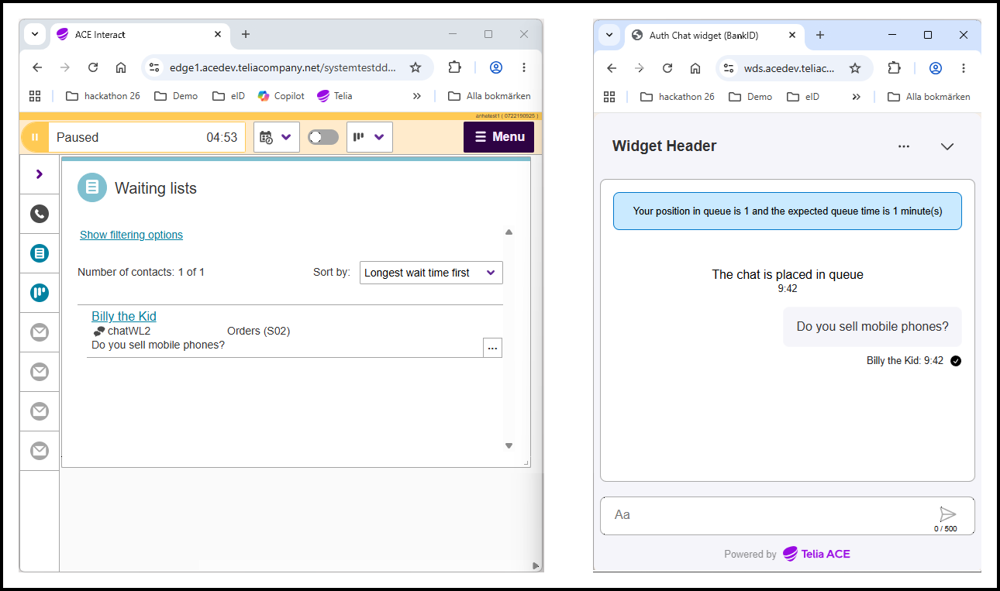

<br>

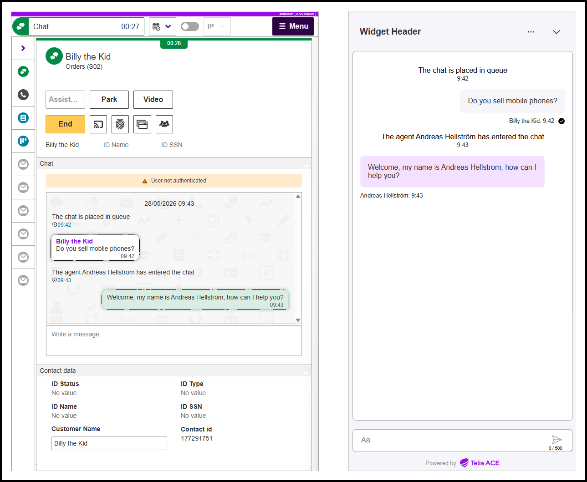

<br>

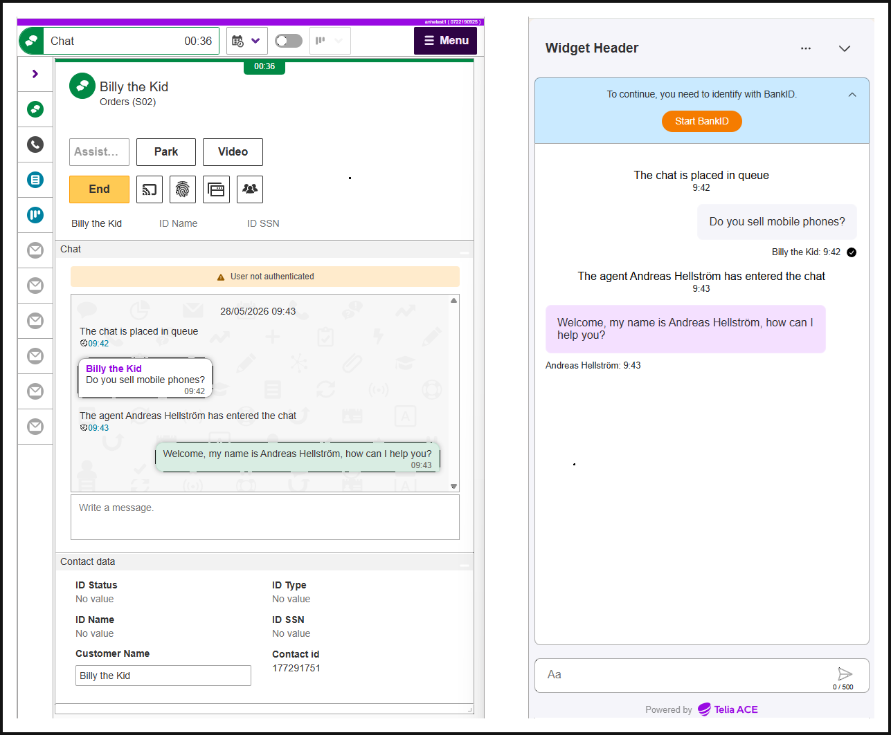

<br>

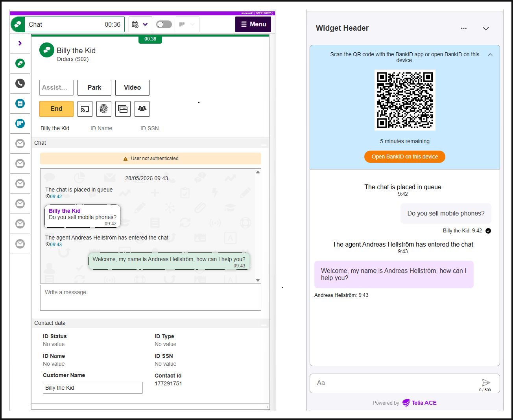

<br>

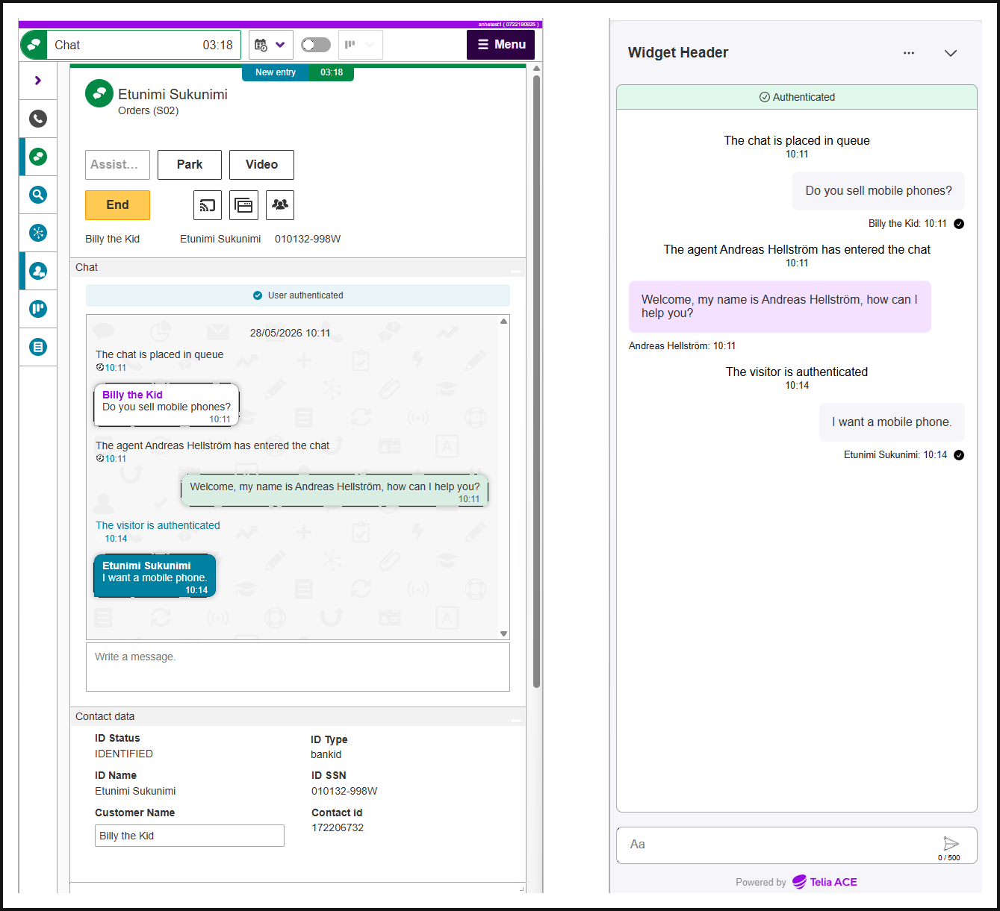

### Chat, customer website supplied identification JWT (Conversational Widget)

Not supported yet.

### Chat, customer website supplied identification JWT (Web SDK)

TODO

### Phone call eID Identification by ACE Identity Hub Web

TODO

### Phone call eID Identification by IVR dialog

TODO

### Phone call eID Identification by IVR parking

TODO

## Appendix D. Sample diagrams & drawings

### eID identification flow

[Open the editable Excalidraw source](./assets/diagrams/eid-identification-flow.excalidraw)

<div data-excalidraw="./assets/diagrams/eid-identification-flow.excalidraw"></div>

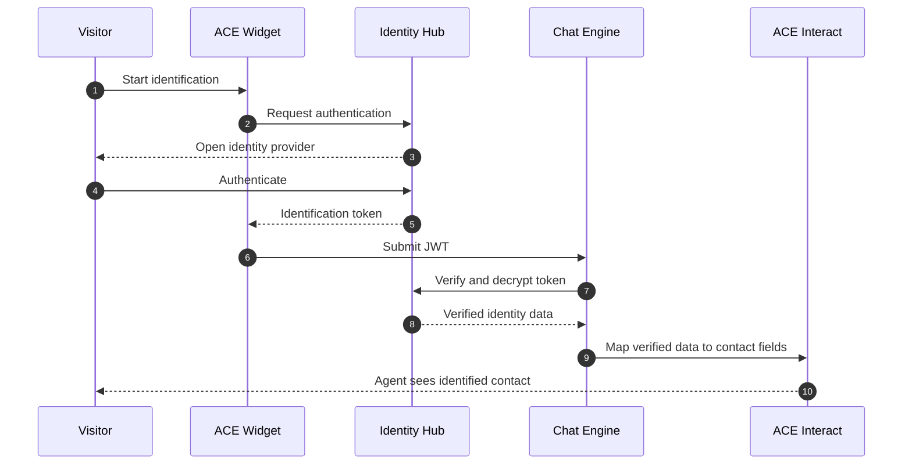

